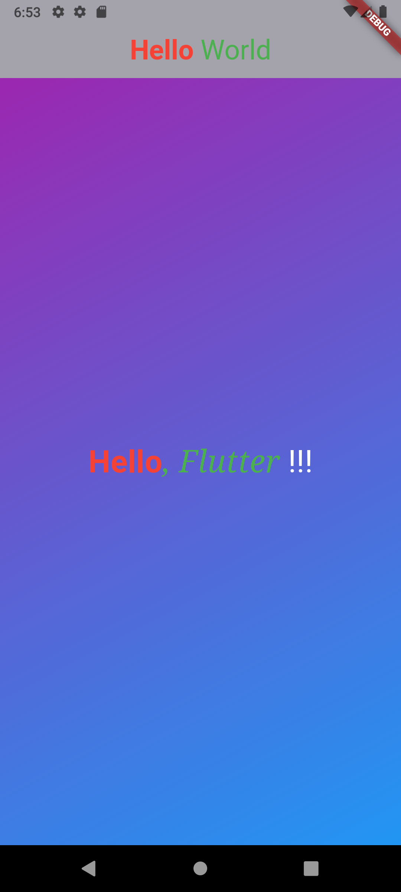

# Hello World Flutter App

A simple and beautiful "Hello World" application built with Flutter. It showcases a basic layout with a gradient background.


## ✨ Features

- Displays a "Hello World" message.
- Features a beautiful gradient background.
- Built with Flutter for cross-platform compatibility (iOS & Android).
- Clean and simple code structure, perfect for beginners.

## 📱 Screenshots

Here's a sneak peek of the application in action.

<!-- 
1. Create a 'screenshots' folder in your project root.
2. Add your screenshot to that folder (e.g., 'screenshots/app-screenshot.png').
3. Update the link below to point to your screenshot.
-->


## 🚀 Getting Started

To get a local copy up and running, follow these simple steps.

### Prerequisites

Make sure you have the Flutter SDK installed on your machine. For instructions on how to install Flutter, see the [online documentation](https://docs.flutter.dev/get-started/install).

### Installation

1.  **Clone the repo**
    ```sh
    git clone https://github.com/your_username/hello_world.git
    ```
2.  **Navigate to the project directory**
    ```sh
    cd hello_world
    ```
3.  **Install dependencies**
    ```sh
    flutter pub get
    ```
4.  **Run the app**
    ```sh
    flutter run
    ```

## 🤝 Contributing

Contributions are what make the open-source community such an amazing place to learn, inspire, and create. Any contributions you make are **greatly appreciated**.

If you have a suggestion that would make this better, please fork the repo and create a pull request. You can also simply open an issue with the tag "enhancement".
Don't forget to give the project a star! Thanks again!

1.  Fork the Project
2.  Create your Feature Branch (`git checkout -b feature/AmazingFeature`)
3.  Commit your Changes (`git commit -m 'Add some AmazingFeature'`)
4.  Push to the Branch (`git push origin feature/AmazingFeature`)
5.  Open a Pull Request

## 📜 License

Distributed under the MIT License. You will need to add a `LICENSE` file to your project.
